<p align="center">
  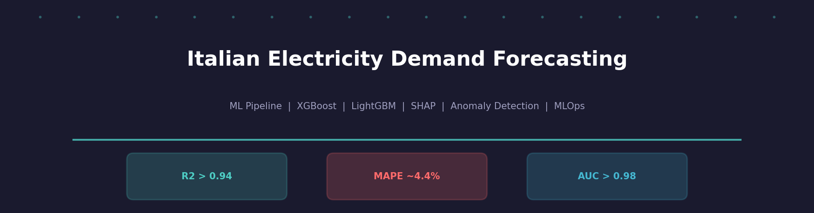
</p>

<h1 align="center">Italian Electricity Demand Forecasting</h1>

<p align="center">
  <em>End-to-end ML pipeline for short-term load forecasting on the Italian power grid</em>
</p>

<p align="center">
  <a href="https://github.com/ogiannopoulou/energy-demand-prediction/actions/workflows/ml_pipeline.yml"></a>
  
  
  
  
</p>

<p align="center">
  <a href="PROJECT_REPORT.md">Full Report</a> ·
  <a href="https://energy-demand-prediction.streamlit.app">Live Dashboard</a> ·
  <a href="https://github.com/ogiannopoulou/energy-demand-prediction/pkgs/container/energy-demand-prediction">Docker Image</a>
</p>

---

## Results

| Model | R² | MAE (MW) | MAPE | Training Time |
|-------|----|----------|------|---------------|
| **LightGBM** | 0.9457 | 1,207 | 4.35% | ~8s |
| **XGBoost** | 0.9446 | 1,220 | 4.41% | ~12s |

<p align="center">
  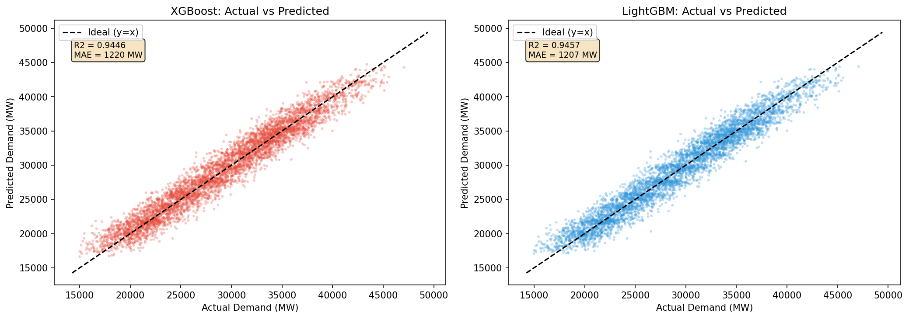
</p>

---

## Architecture

<p align="center">
  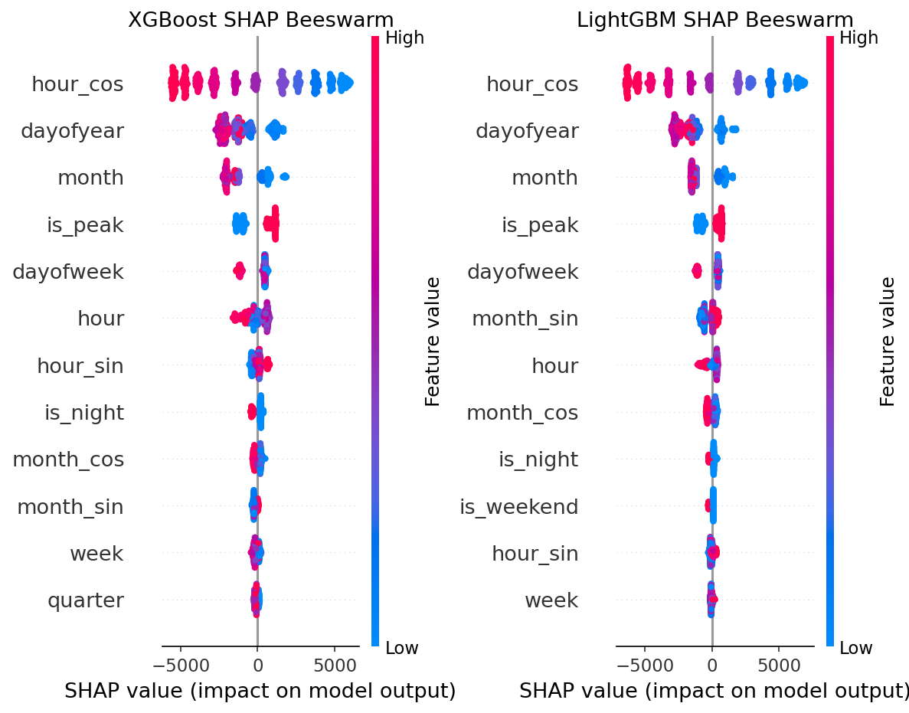
</p>

```
ENTSO-E API ──▶ Feature Engineering ──▶ Model Training ──▶ Evaluation
  (or Synthetic)    (54 features)        (XGB / LGBM)      (SHAP + MLflow)
                         │                    │                   │
                         ▼                    ▼                   ▼
                    Anomaly Detection    API Serving         Dashboard
                    (Isolation Forest)   (FastAPI)           (Streamlit)
```

---

## MLOps

<p align="center">
  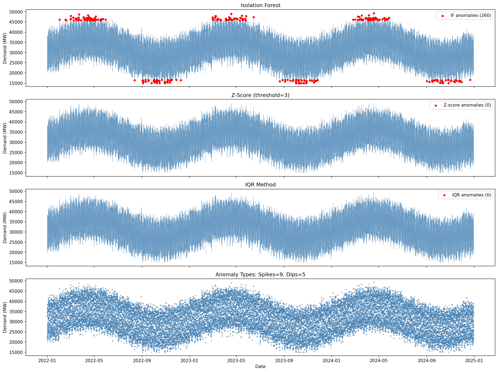
</p>

| Layer | Tool | Status |
|-------|------|--------|
| CI/CD | GitHub Actions | 3-stage: test → train → build |
| Experiment Tracking | MLflow + SQLite | Params, metrics, models logged |
| API | FastAPI | `/health`, `/models`, `/predict` |
| Containerization | Docker | Multi-stage build → GHCR |
| Monitoring | Streamlit | Interactive anomaly dashboard |

### CI/CD Pipeline

```
  push ──▶ lint (ruff) ──▶ test (22 pytest) ──▶ train (XGB + LGBM) ──▶ build (Docker → GHCR)
```

Every commit to `main` automatically lints, tests, trains models on ENTSO-E data, and deploys a Docker image to GitHub Container Registry.

---

## Notebooks

| # | Notebook | What it covers |
|---|----------|----------------|
| 01 | [Data Ingestion](notebooks/01_data_ingestion.ipynb) | ENTSO-E API, EDA, statistical summaries |
| 02 | [Forecasting](notebooks/02_forecasting.ipynb) | XGBoost & LightGBM, SHAP analysis |
| 03 | [Anomaly Detection](notebooks/03_anomaly_detection.ipynb) | Isolation Forest, Z-score, IQR |
| 04 | [Classification](notebooks/04_classification.ipynb) | Peak/off-peak, ROC curves |
| 05 | [LLM Report](notebooks/05_llm_report.ipynb) | Automated report generation |
| 06 | [Diagnostics](notebooks/06_diagnostics.ipynb) | 13 diagnostic plots |

---

<details>
<summary><strong>Diagnostics</strong></summary>

<br>

| | | |
|:---:|:---:|:---:|
|  | 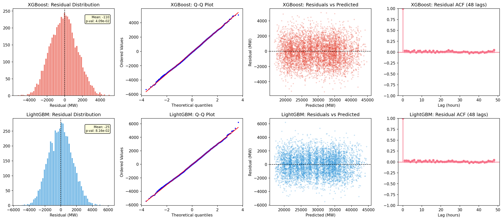 | 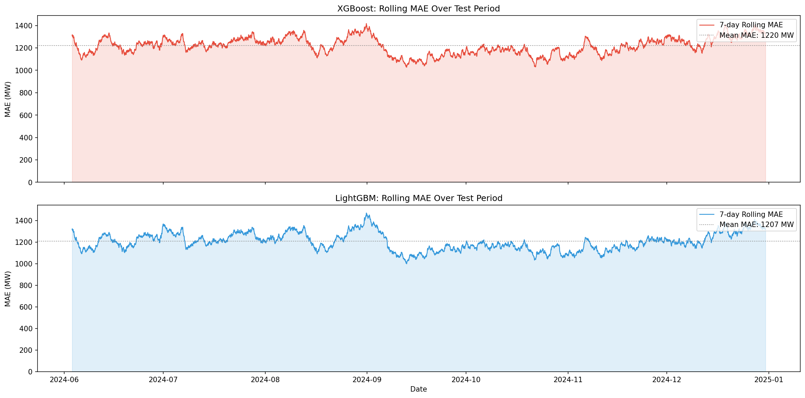 |
| 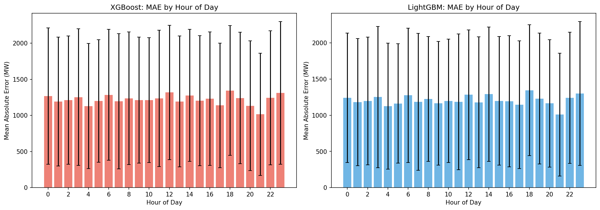 |  | 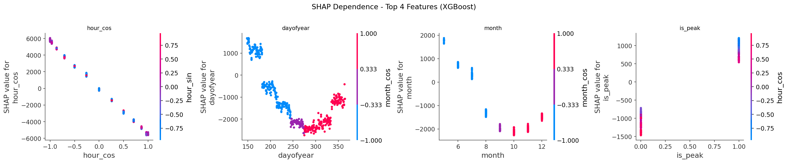 |
| 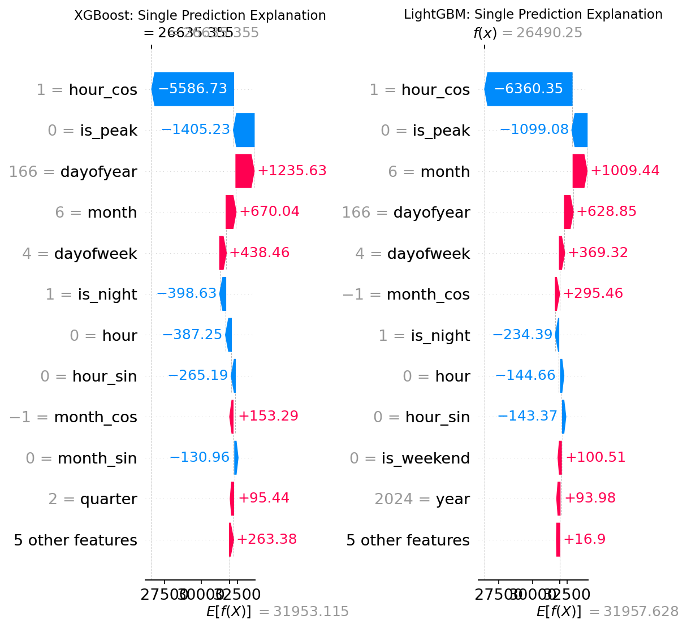 |  | 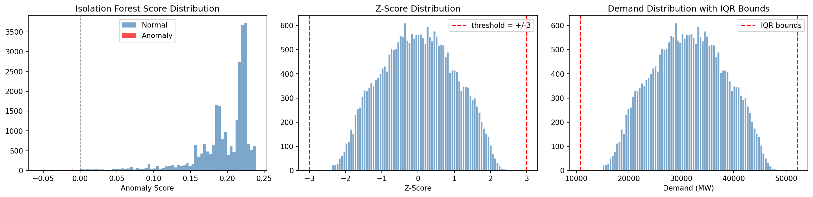 |
| 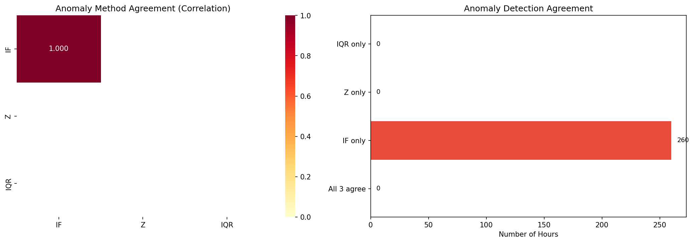 | 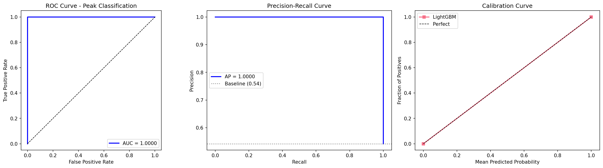 | 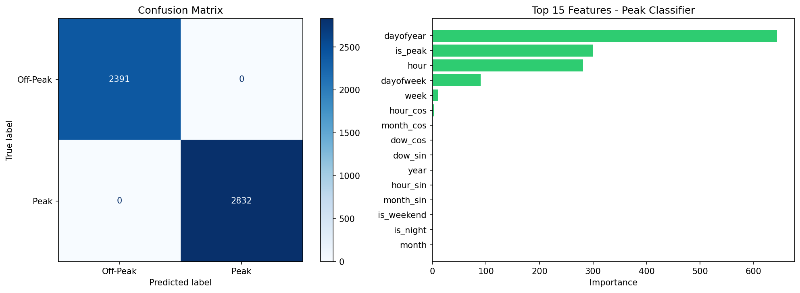 |
| 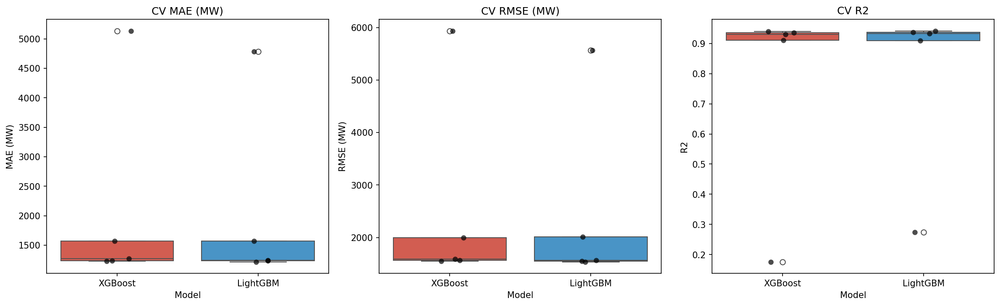 | | |

</details>

---

## Quick Start

```bash
git clone https://github.com/ogiannopoulou/energy-demand-prediction.git
cd energy-demand-prediction && python -m venv .venv && source .venv/bin/activate
make setup          # install dependencies
make test           # run 22 tests
make train          # train models (falls back to synthetic without API key)
make api            # start FastAPI server on :8000
make docker-up      # full stack with Docker Compose
```

---

## Tech Stack

<p align="center">
  
  
  
  
  
  
  
  
</p>

---

## Project Structure

```
.
├── src/
│   ├── data/                  # ENTSO-E client + 54-feature pipeline
│   ├── models/                # XGBoost, LightGBM, Isolation Forest, SHAP
│   ├── monitoring/            # MLflow experiment tracking
│   └── llm/                   # Automated report generation
├── api/                       # FastAPI prediction server
├── tests/                     # 22 tests (data, models, API, MLOps)
├── notebooks/                 # 6 Jupyter notebooks
├── .github/workflows/         # CI/CD pipeline
├── Dockerfile                 # Multi-stage Docker build
├── Makefile                   # Dev commands
└── pyproject.toml             # Project config
```

---

<p align="center">
  <strong>Ourania Giannopoulou</strong> · Applied Mathematics PhD<br>
  <a href="https://linkedin.com/in/rania-giannopoulou">LinkedIn</a> · <a href="https://github.com/ogiannopoulou">GitHub</a>
</p>
